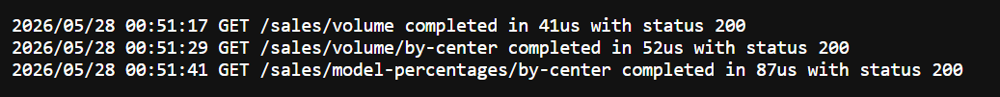

# COTO Go API

App live:

```txt
https://coto-app-89obl.ondigitalocean.app
```

API REST para el ejercicio de ventas de una fabrica de automoviles. La app guarda ventas mockeadas en memoria y expone metricas agregadas.

## Funcionalidades

- Crear ventas.
- Obtener volumen total de ventas.
- Obtener volumen de ventas por centro de distribucion.
- Obtener porcentajes de unidades por modelo y centro.
- Generar ventas fake al iniciar la app.
- Borrar y regenerar datos fake para demos.
- Cachear respuestas agregadas de los endpoints GET hasta que cambien los datos.
- Loguear el tiempo de ejecucion de cada request y devolverlo en `X-Request-Duration`.
- Ver logs en vivo desde `/logs/stream`.
- Especificacion OpenAPI disponible en `openapi.yml`.

## Ejecutar

```bash
go run ./cmd/api
```

`.env` opcional:

```env
PORT=8080
```

## Estructura

| Ruta | Descripcion |
| --- | --- |
| `cmd/api` | Punto de entrada de la aplicacion |
| `internal/http/router` | Rutas y tabla de endpoints al iniciar |
| `internal/http/handler` | Handlers HTTP |
| `internal/http/middleware` | Middleware de medicion de tiempo |
| `internal/logging` | Logger a stdout con stream en vivo |
| `internal/sales` | Dominio, store, service y cache de ventas |
| `internal/sales/fake` | Generacion de ventas fake |
| `openapi.yml` | Contrato API para importar en Postman |

## Decisiones Tecnicas

- El dinero se guarda internamente en centavos para evitar problemas de redondeo.
- Las respuestas HTTP devuelven montos legibles, no centavos.
- El modelo `Sport` aplica el impuesto extra del 7%.
- Los agregados se cachean en memoria y se invalidan al crear, borrar o regenerar ventas.
- Los datos fake se generan en memoria con distribucion no uniforme de modelos y centros.

## Como Probar

### 📘 Probar con Swagger

Abrir Swagger Editor con el contrato cargado:

```txt
https://editor.swagger.io/?url=https://raw.githubusercontent.com/jarraga/coto-back/main/openapi.yml
```

Ver logs en vivo:

```bash
curl -N https://coto-app-89obl.ondigitalocean.app/logs/stream
```



Crear una venta:

```bash
curl -X POST https://coto-app-89obl.ondigitalocean.app/sales ^
  -H "Content-Type: application/json" ^
  -d "{\"model\":\"Sport\",\"distributionCenter\":\"north\",\"units\":2}"
```

Obtener volumen total de ventas:

```bash
curl https://coto-app-89obl.ondigitalocean.app/sales/volume
```

Obtener volumen de ventas por centro:

```bash
curl https://coto-app-89obl.ondigitalocean.app/sales/volume/by-center
```

Obtener porcentajes por modelo y centro:

```bash
curl https://coto-app-89obl.ondigitalocean.app/sales/model-percentages/by-center
```

Borrar el store:

```bash
curl -X DELETE https://coto-app-89obl.ondigitalocean.app/ops/store
```

Regenerar ventas fake:

```bash
curl -X POST https://coto-app-89obl.ondigitalocean.app/ops/store/seed
```

Health check:

```bash
curl https://coto-app-89obl.ondigitalocean.app/
```

## Tests

```bash
go test ./...
```

Cobertura solicitada por el ejercicio:

```bash
go test ./... -cover
```
